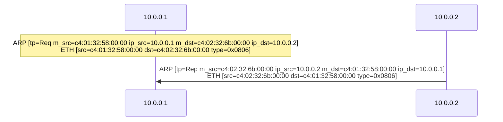
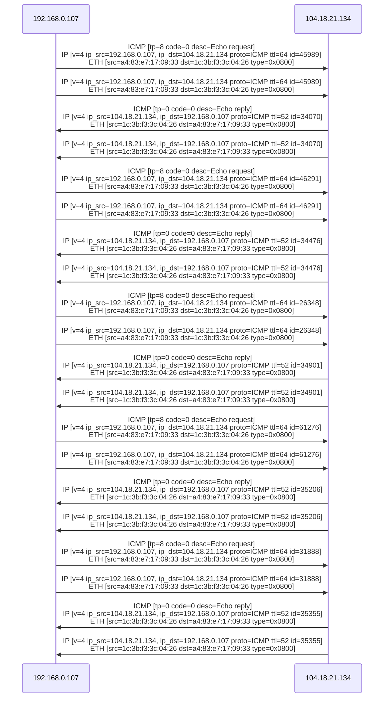
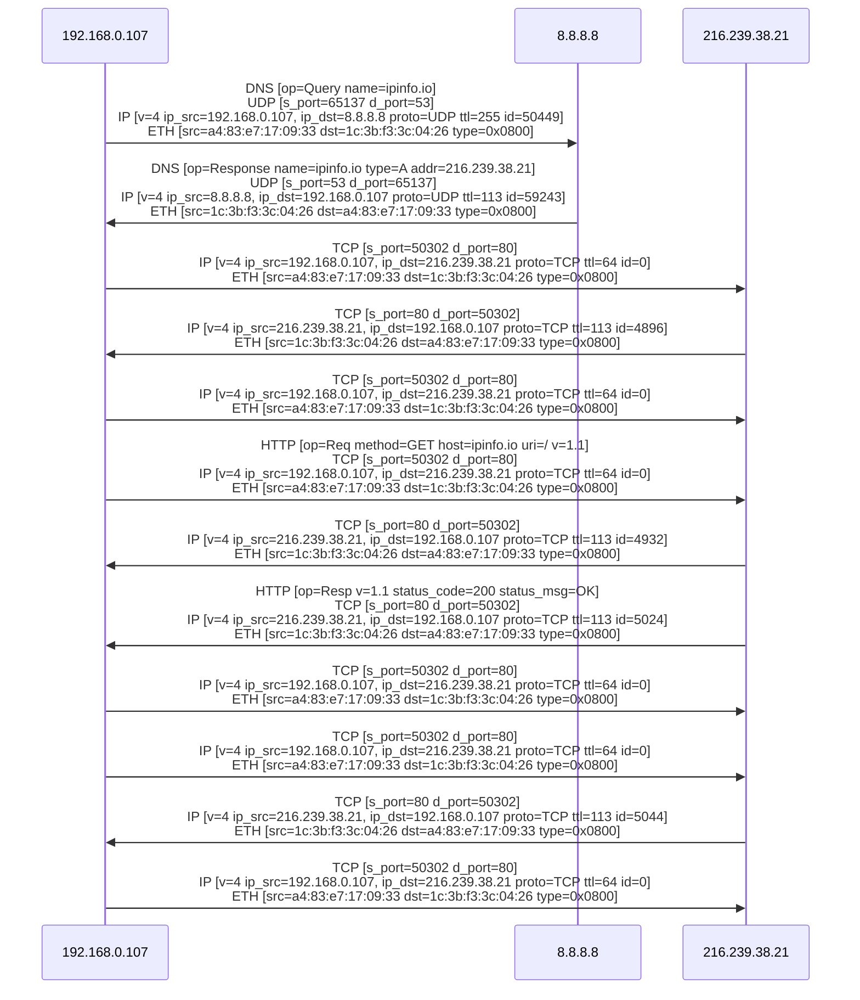
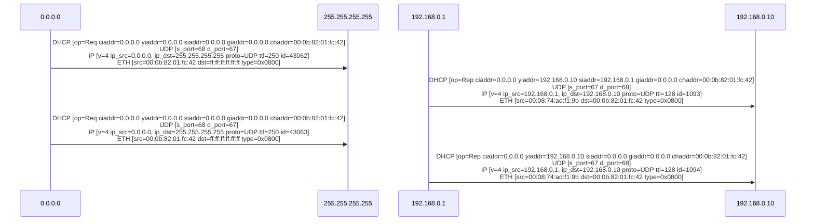
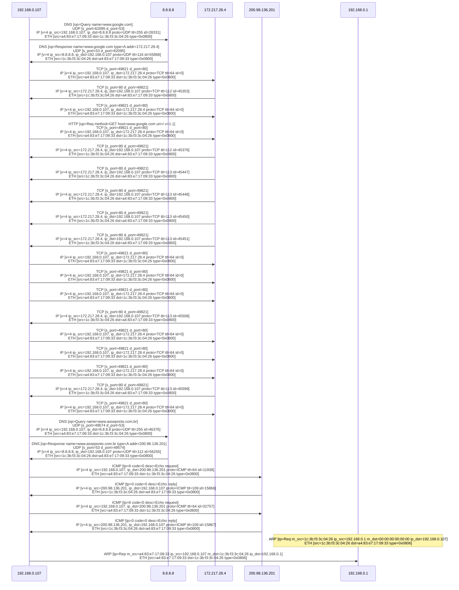

# PCAP to Mermaid file parser

## Description
Parser for `.pcap` files to [Mermaid](https://mermaid-js.github.io/mermaid/#/) representation. This parser reads a `.pcap` file and outputs a Mermaid [Sequence Diagram](https://mermaid-js.github.io/mermaid/#/sequenceDiagram) in the stdout of the console.

## Usage

```sh
$ python3 parser.py -h

usage: parser.py [-h] [-c pkt_count] file_path

PCAP to Mermaid file parser

positional arguments:
  file_path             Path for the .pcap file to parse

optional arguments:
  -h, --help            show this help message and exit
  -c pkt_count, --count pkt_count
                        Number of packets to parse
```

### Dependencies
- Python >= 3
- DPKT >= 1.9.2

To install the dependencies for this project you can run this command:

```sh
$ pip3 install -r dependencies.txt
```

## Protocols
Supported protocols and values that are shown in the sequence diagram.

### Data Link Layer (OSI L2)
- [Ethernet](https://en.wikipedia.org/wiki/Ethernet)
  - MAC Src
  - MAC Dest
  - Type
- [ARP](https://en.wikipedia.org/wiki/Address_Resolution_Protocol)
  - Type
  - MAC Src
  - MAC Dest
  - IP Src
  - IP Dest

### Network Layer (OSI L3)
- [IP](https://en.wikipedia.org/wiki/Internet_Protocol)
  - Version
  - IP Src
  - IP Dest
  - Protocol
  - TTL
  - Identification (ID)
- [ICMP](https://en.wikipedia.org/wiki/Internet_Control_Message_Protocol)
  - Type
  - Code

### Transport Layer (OSI L4)
- [TCP](https://en.wikipedia.org/wiki/Transmission_Control_Protocol)
  - Port Src
  - Port Dest
- [UDP](https://en.wikipedia.org/wiki/User_Datagram_Protocol)
  - Port Src
  - Port Dest

### Application Layer (OSI L7)
- [DHCP](https://en.wikipedia.org/wiki/DHCP)
  - Operation
  - Client IP Address
  - Your IP Address
  - Server IP Address
  - Gateway IP Address
  - Client Hardware Address
- [DNS](https://en.wikipedia.org/wiki/DNS)
  - Operation
  - Name
  - Type 
  - Address
- [HTTP](https://en.wikipedia.org/wiki/HTTP)
  - Request
    - Method
    - Host
    - URI
    - Version
  - Response
    - Version
    - Status Code
    - Status Message


## Examples

### Arp Request/Reply
```sh
$ python3 parser.py examples/arp.pcap
```



### Ping with Fragmented Packets
```sh
$ python3 parser.py examples/frag-ping.pcap
```



### HTTP Request with DNS Resolution 
> HTTP Request: curl ipinfo.io

```sh
$ python3 parser.py examples/ipinfo-http.pcap
```



### DHCP Example
```sh
$ python3 parser.py examples/dhcp.pcap
```



### Complete execution of almost all protocols
```sh
$ python3 parser.py examples/complete-flow.pcap
```



## Resources
Here is a list of resources used to build this parser. Not all of the resources are being used in the final version, they were used for knowledge before I started to develop this parser.

- [Mermaid Diagrams](https://mermaid-js.github.io/mermaid/#/flowchart)
- [DPKT Python](https://dpkt.readthedocs.io/en/latest/index.html). Tutorial [example](https://jon.oberheide.org/blog/2008/10/15/dpkt-tutorial-2-parsing-a-pcap-file/). Program [example](https://chains.readthedocs.io/en/latest/)
- [cheatsheet dpkt](https://engineering-notebook.readthedocs.io/en/latest/engineering/dpkt.html)
- [DPKT User Doc](http://www.commercialventvac.com/dpkt.html#mozTocId319619)
- [DPKT User Examples](https://github.com/jeffsilverm/dpkt_doc)
- [WinPcap in your programs](https://www.winpcap.org/docs/docs_412/html/group__wpcapsamps.html). Pcap file parser in c/c++
- [PcapPlusPlus](https://pcapplusplus.github.io/docs/tutorials/intro). Pcap tutorial in c++
- [Reading Pcap files with Scapy](https://incognitjoe.github.io/reading-pcap-with-scapy.html). Pcap parsing with [scapy](https://scapy.readthedocs.io/en/latest/introduction.html)
- [How to capture and analyze packets with tcpdum](https://www.linuxtechi.com/capture-analyze-packets-tcpdump-command-linux/)
- [pcap-ct](https://pypi.org/project/pcap-ct/)
- [pypcap](https://github.com/pynetwork/pypcap)
- [sample](https://wiki.wireshark.org/SampleCaptures) captures wireshark

## Roadmap
- [ ] Add live presentation after parsing the .pcap file
- [ ] Add support fore more protocols
- [ ] Add filters for the parsing like [tcpdump filters](https://www.tcpdump.org/manpages/pcap-filter.7.html)
- [ ] Add colored visual representation of the request and responses for each protocol
- [ ] Add live packet capture and parsing of packets
