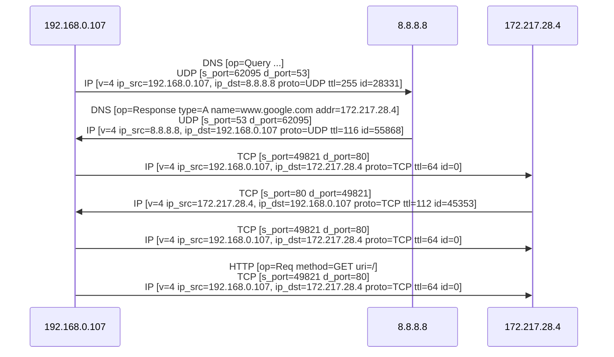

```mermaid
sequenceDiagram
	192.168.0.107->>8.8.8.8: DNS [op=Query ...]<br>UDP [s_port=62095  d_port=53]<br>IP [v=4 ip_src=192.168.0.107, ip_dst=8.8.8.8 proto=UDP ttl=255 id=28331]
	8.8.8.8->>192.168.0.107: DNS [op=Response type=A name=www.google.com addr=172.217.28.4]<br>UDP [s_port=53  d_port=62095]<br>IP [v=4 ip_src=8.8.8.8, ip_dst=192.168.0.107 proto=UDP ttl=116 id=55868]
	192.168.0.107->>172.217.28.4: TCP [s_port=49821 d_port=80]<br>IP [v=4 ip_src=192.168.0.107, ip_dst=172.217.28.4 proto=TCP ttl=64 id=0]
	172.217.28.4->>192.168.0.107: TCP [s_port=80 d_port=49821]<br>IP [v=4 ip_src=172.217.28.4, ip_dst=192.168.0.107 proto=TCP ttl=112 id=45353]
	192.168.0.107->>172.217.28.4: TCP [s_port=49821 d_port=80]<br>IP [v=4 ip_src=192.168.0.107, ip_dst=172.217.28.4 proto=TCP ttl=64 id=0]
	192.168.0.107->>172.217.28.4: HTTP [op=Req method=GET uri=/]<br>TCP [s_port=49821 d_port=80]<br>IP [v=4 ip_src=192.168.0.107, ip_dst=172.217.28.4 proto=TCP ttl=64 id=0]
```
