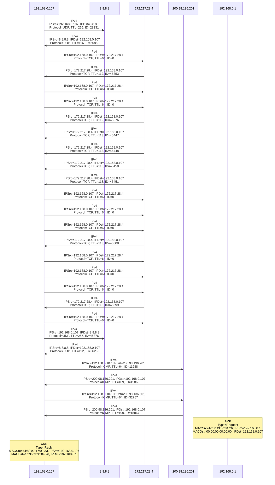

```mermaid
sequenceDiagram
	 192.168.0.107->>8.8.8.8: IPv4<br>IPSrc=192.168.0.107, IPDst=8.8.8.8<br>Protocol=UDP, TTL=255, ID=28331
	 8.8.8.8->>192.168.0.107: IPv4<br>IPSrc=8.8.8.8, IPDst=192.168.0.107<br>Protocol=UDP, TTL=116, ID=55868
	 192.168.0.107->>172.217.28.4: IPv4<br>IPSrc=192.168.0.107, IPDst=172.217.28.4<br>Protocol=TCP, TTL=64, ID=0
	 172.217.28.4->>192.168.0.107: IPv4<br>IPSrc=172.217.28.4, IPDst=192.168.0.107<br>Protocol=TCP, TTL=112, ID=45353
	 192.168.0.107->>172.217.28.4: IPv4<br>IPSrc=192.168.0.107, IPDst=172.217.28.4<br>Protocol=TCP, TTL=64, ID=0
	 192.168.0.107->>172.217.28.4: IPv4<br>IPSrc=192.168.0.107, IPDst=172.217.28.4<br>Protocol=TCP, TTL=64, ID=0
	 172.217.28.4->>192.168.0.107: IPv4<br>IPSrc=172.217.28.4, IPDst=192.168.0.107<br>Protocol=TCP, TTL=112, ID=45376
	 172.217.28.4->>192.168.0.107: IPv4<br>IPSrc=172.217.28.4, IPDst=192.168.0.107<br>Protocol=TCP, TTL=113, ID=45447
	 172.217.28.4->>192.168.0.107: IPv4<br>IPSrc=172.217.28.4, IPDst=192.168.0.107<br>Protocol=TCP, TTL=113, ID=45448
	 172.217.28.4->>192.168.0.107: IPv4<br>IPSrc=172.217.28.4, IPDst=192.168.0.107<br>Protocol=TCP, TTL=113, ID=45450
	 172.217.28.4->>192.168.0.107: IPv4<br>IPSrc=172.217.28.4, IPDst=192.168.0.107<br>Protocol=TCP, TTL=113, ID=45451
	 192.168.0.107->>172.217.28.4: IPv4<br>IPSrc=192.168.0.107, IPDst=172.217.28.4<br>Protocol=TCP, TTL=64, ID=0
	 192.168.0.107->>172.217.28.4: IPv4<br>IPSrc=192.168.0.107, IPDst=172.217.28.4<br>Protocol=TCP, TTL=64, ID=0
	 192.168.0.107->>172.217.28.4: IPv4<br>IPSrc=192.168.0.107, IPDst=172.217.28.4<br>Protocol=TCP, TTL=64, ID=0
	 172.217.28.4->>192.168.0.107: IPv4<br>IPSrc=172.217.28.4, IPDst=192.168.0.107<br>Protocol=TCP, TTL=113, ID=45508
	 192.168.0.107->>172.217.28.4: IPv4<br>IPSrc=192.168.0.107, IPDst=172.217.28.4<br>Protocol=TCP, TTL=64, ID=0
	 192.168.0.107->>172.217.28.4: IPv4<br>IPSrc=192.168.0.107, IPDst=172.217.28.4<br>Protocol=TCP, TTL=64, ID=0
	 192.168.0.107->>172.217.28.4: IPv4<br>IPSrc=192.168.0.107, IPDst=172.217.28.4<br>Protocol=TCP, TTL=64, ID=0
	 172.217.28.4->>192.168.0.107: IPv4<br>IPSrc=172.217.28.4, IPDst=192.168.0.107<br>Protocol=TCP, TTL=113, ID=45599
	 192.168.0.107->>172.217.28.4: IPv4<br>IPSrc=192.168.0.107, IPDst=172.217.28.4<br>Protocol=TCP, TTL=64, ID=0
	 192.168.0.107->>8.8.8.8: IPv4<br>IPSrc=192.168.0.107, IPDst=8.8.8.8<br>Protocol=UDP, TTL=255, ID=46376
	 8.8.8.8->>192.168.0.107: IPv4<br>IPSrc=8.8.8.8, IPDst=192.168.0.107<br>Protocol=UDP, TTL=112, ID=56255
	 192.168.0.107->>200.98.136.201: IPv4<br>IPSrc=192.168.0.107, IPDst=200.98.136.201<br>Protocol=ICMP, TTL=64, ID=11938
	 200.98.136.201->>192.168.0.107: IPv4<br>IPSrc=200.98.136.201, IPDst=192.168.0.107<br>Protocol=ICMP, TTL=109, ID=15866
	 192.168.0.107->>200.98.136.201: IPv4<br>IPSrc=192.168.0.107, IPDst=200.98.136.201<br>Protocol=ICMP, TTL=64, ID=32757
	 200.98.136.201->>192.168.0.107: IPv4<br>IPSrc=200.98.136.201, IPDst=192.168.0.107<br>Protocol=ICMP, TTL=109, ID=15867
	  Note over 192.168.0.1: ARP <br>Type=Request<br>MACSrc=1c:3b:f3:3c:04:26, IPSrc=192.168.0.1<br>MACDst=00:00:00:00:00:00, IPDst=192.168.0.107<br>
	  Note over 192.168.0.107: ARP <br>Type=Reply<br>MACSrc=a4:83:e7:17:09:33, IPSrc=192.168.0.107<br>MACDst=1c:3b:f3:3c:04:26, IPDst=192.168.0.1<br>
```
