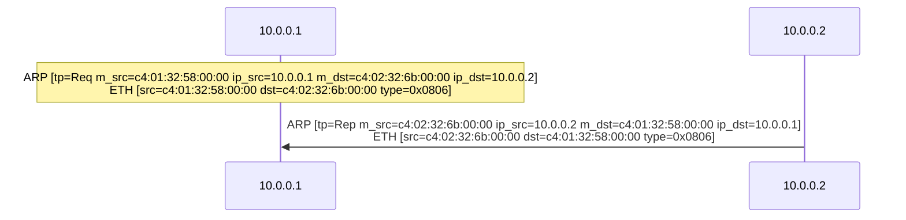

```mermaid
sequenceDiagram
	Note over 10.0.0.1: ARP [tp=Req m_src=c4:01:32:58:00:00 ip_src=10.0.0.1 m_dst=c4:02:32:6b:00:00 ip_dst=10.0.0.2]<br>ETH [src=c4:01:32:58:00:00 dst=c4:02:32:6b:00:00 type=0x0806]
	10.0.0.2->>10.0.0.1: ARP [tp=Rep m_src=c4:02:32:6b:00:00 ip_src=10.0.0.2 m_dst=c4:01:32:58:00:00 ip_dst=10.0.0.1]<br>ETH [src=c4:02:32:6b:00:00 dst=c4:01:32:58:00:00 type=0x0806]
```
